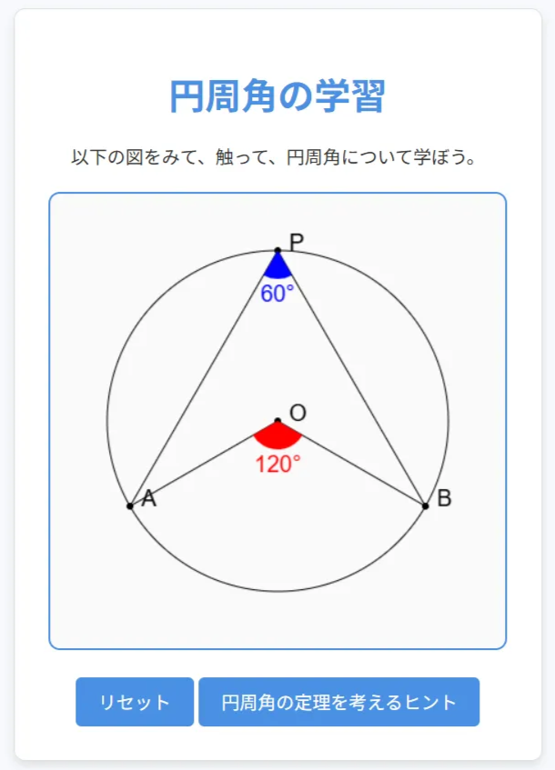

# 円周角の定理を理解するアプリ

中学生向けに「円周角の定理」を直感的に学べる Web アプリケーションです。点を自由に動かしながら、角度の関係を視覚的に確認できます。

---

## 📖 背景と目的

教育委員会などが提供するデジタル教材や、GeoGebra のような動的数学ソフトウェアは有用ですが、授業中に不具合が生じるケースもあります。  
私自身も中学校で数学を教えるなかで、こうした不具合により生徒の理解を妨げてしまう経験がありました。

そこで「自分でアプリケーションを作れば、必要に応じて修正しながら使える」と考え、本アプリの開発を始めました。

---

## 🛠 使用技術

- HTML / CSS / JavaScript
- GeoGebra 風の動的 UI を独自実装
- モバイル最適化（スマホ・iPadでの授業利用を想定）

---

## 🚀 デモ

👉 [アプリを使ってみる](https://kk-edu-tech.github.io/inscribed-angle-theorem/) 

👉 [Notion 解説ページ](https://raspy-store-96c.notion.site/24288083f5268095a827da09d4e2e204)

---

## 🧩 機能概要

- 点 A, B, P をドラッグして動かすことで、円周角と中心角の関係を可視化
- 中心角と円周角の大きさがリアルタイムに表示される
- レスポンシブ対応でタブレットやスマホからも使用可能

---

## 📸 スクリーンショット

---

## 🙋‍♂️ 作者

- **名前**：kk-ed-tech  
- **職業**：中学校数学教員  
- **ポートフォリオ**：[Notionページ](https://raspy-store-96c.notion.site/kk-ed-tech-24288083f526807ea506d0358fb1b94c?source=copy_link)  
- **GitHub**：[kk-edu-tech](https://github.com/kk-edu-tech)
